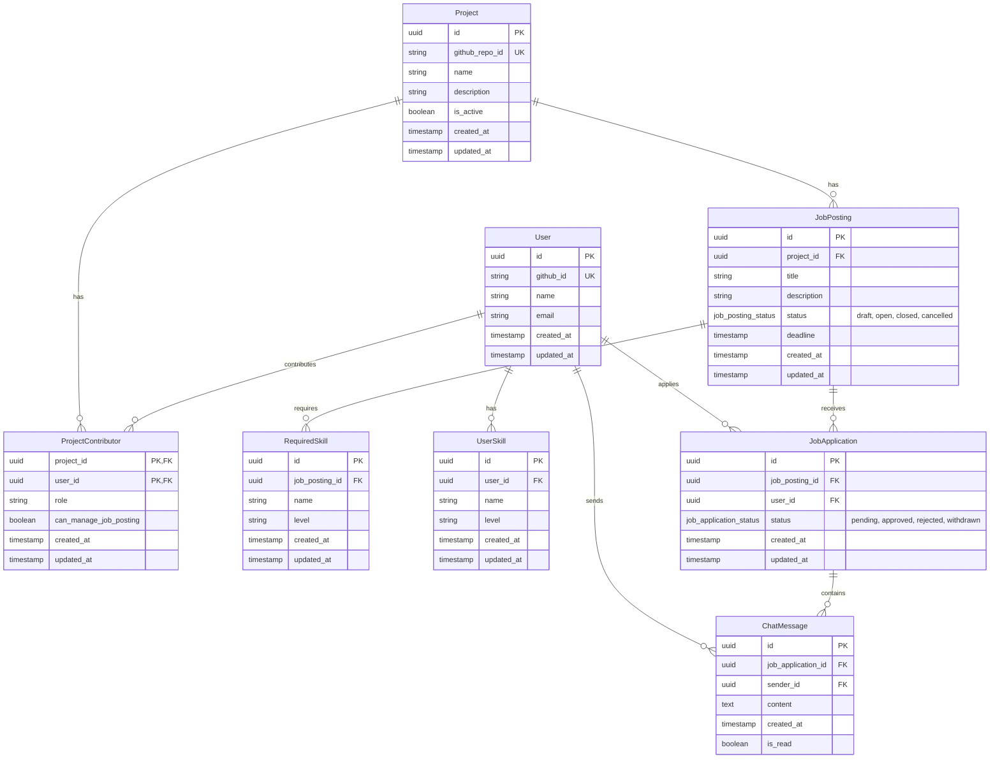

# ER図

```mermaid
erDiagram
    User ||--o{ ProjectContributor : contributes
    Project ||--o{ ProjectContributor : has
    Project ||--o{ JobPosting : has
    JobPosting ||--o{ RequiredSkill : requires
    User ||--o{ UserSkill : has
    JobPosting ||--o{ JobApplication : receives
    User ||--o{ JobApplication : applies
    JobApplication ||--o{ ChatMessage : contains
    User ||--o{ ChatMessage : sends

    User {
        uuid id PK
        string github_id UK
        string name
        string email
        timestamp created_at
        timestamp updated_at
    }

    Project {
        uuid id PK
        string github_repo_id UK
        string name
        string description
        boolean is_active
        timestamp created_at
        timestamp updated_at
    }

    ProjectContributor {
        uuid project_id PK,FK
        uuid user_id PK,FK
        string role
        boolean can_manage_job_posting
        timestamp created_at
        timestamp updated_at
    }

    JobPosting {
        uuid id PK
        uuid project_id FK
        string title
        string description
        job_posting_status status "draft, open, closed, cancelled"
        timestamp deadline
        timestamp created_at
        timestamp updated_at
    }

    JobApplication {
        uuid id PK
        uuid job_posting_id FK
        uuid user_id FK
        job_application_status status "pending, approved, rejected, withdrawn"
        timestamp created_at
        timestamp updated_at
    }

    ChatMessage {
        uuid id PK
        uuid job_application_id FK
        uuid sender_id FK
        text content
        timestamp created_at
        boolean is_read
    }

    RequiredSkill {
        uuid id PK
        uuid job_posting_id FK
        string name
        string level
        timestamp created_at
        timestamp updated_at
    }

    UserSkill {
        uuid id PK
        uuid user_id FK
        string name
        string level
        timestamp created_at
        timestamp updated_at
    }

```